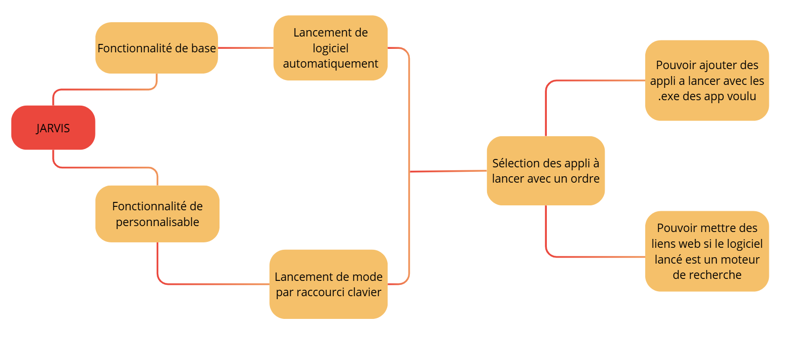

# Jarvis!

**J.A.R.V.I.S.** est un logiciel d'automatisation de bureau développé en Python. Inspiré par l'esthétique hi-tech et épurée de l'univers d'Iron Man, ce programme permet de configurer des profils ou "modes" (ex: Mode Travail, Mode Gaming) et de déclencher une séquence d'actions (lancement d'applications `.exe` et ouverture de liens web) via des raccourcis clavier globaux personnalisés.

Le système intègre un moteur d'écoute réseau basse couche capable de détecter des combinaisons complexes composées uniquement de touches système modificatrices (comme `Ctrl+Alt` ou `Ctrl+Shift`), sans obligation d'y associer une lettre.

---

## 🚀 Fonctionnalités

- **Interface Graphique Épurée :** Une UI moderne et futuriste au style "Stark Industries", propulsée par `CustomTkinter`.
- **Raccourcis Clavier Globaux Intelligents :** Capture automatique et détection en arrière-plan de n'importe quelle combinaison de touches (y compris les modificateurs seuls ou touches de fonction `F1-F12`).
- **Séquenceur d'Actions :** Ajout illimité d'applications locales (`.exe`) et d'URLs web à exécuter dans l'ordre choisi.
- **Sauvegarde Automatique :** Prise en compte instantanée des modifications à la fermeture de l'éditeur sans action manuelle requise.
- **Architecture Modulaire :** Code proprement séparé en modules (GUI, Core, Configs, Assets) pour une maintenance et des évolutions simplifiées.

---

## 📁 Structure du Projet

JARVIS/
│
├── configs/            # Stockage des données utilisateur
│   └── modes.json      # Fichier JSON contenant les configurations des modes
│
├── core/               # Logique métier et moteurs d'arrière-plan
│   ├── __init__.py     # Initialisation du module core
│   ├── action_runner.py# Exécuteur d'applications et de liens web
│   └── hotkey_manager.py# Hook clavier global et détection des raccourcis
│
├── gui/                # Interface utilisateur graphique (GUI)
│   ├── __init__.py     # Initialisation du module gui
│   ├── theme.py        # Thème visuel et palettes de couleurs hi-tech
│   ├── main_window.py  # Tableau de bord principal (liste des modes)
│   └── config_editor.py# Fenêtre de création et modification de mode
│
├── main.py             # Point d'entrée de l'application
└── requirements.txt    # Dépendances du projet